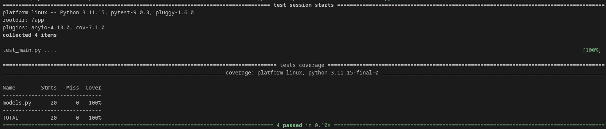

# Testes Unitários

## Explicação do Teste
Para o Sprint 2 da disciplina de Engenharia de Software foram implementados quatro testes unitários: 3 para a classe Vaccines e 1 para a classe Alerts, que forma isoladas no arquivo "models.py", gerando uma cobertura de 100% nos testes feitos.

O primeiro testa a criação de uma vacina válida, o segundo a criação de uma vacina com um nome inválido (espaço em branco), o terceiro a criação de uma vacina com id inválido (um texto) e o quarto a criação de um alerta válido.

Como é possível observar na imagem a seguir, todos os testes foram feitos com sucesso e isso gerou uma cobertura de 100%.

É válido citar que os testes foram feitos em um dispositivo com Sistema Operacional Pop!_OS.

## Imagem do Teste
