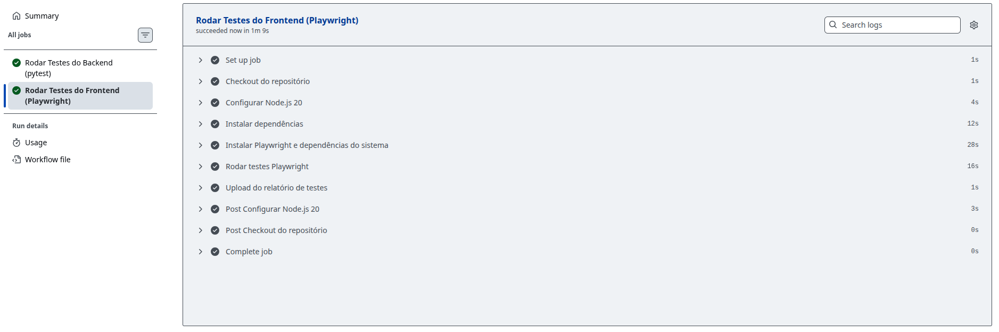

# Integração Contínua (CI)

## Explicação da Integração Contínua

Para o Sprint 3 da disciplina de Engenharia de Software foi implementada a Integração Contínua (CI) utilizando o GitHub Actions, com o objetivo de automatizar a execução dos testes a cada modificação no repositório.

O pipeline de CI foi configurado no arquivo `.github/workflows/ci.yml` e é composto por dois jobs: o primeiro, `testes-backend`, responsável por executar os testes do backend utilizando o `pytest` no arquivo `BackEnd/test_main.py`; e o segundo, `testes-frontend`, responsável por subir o servidor Next.js e executar os testes end-to-end com o Playwright.

O pipeline é disparado automaticamente a cada push para as branches `main` ou `develop`, e a cada pull request direcionado à `main`, garantindo que nenhuma alteração quebre o funcionamento da aplicação sem que isso seja detectado antes da integração.

Como é possível observar na imagem a seguir, todos os jobs foram executados com sucesso, confirmando que tanto o backend quanto o frontend estão funcionando corretamente de forma integrada e automatizada.

## Imagem da Integração Contínua
